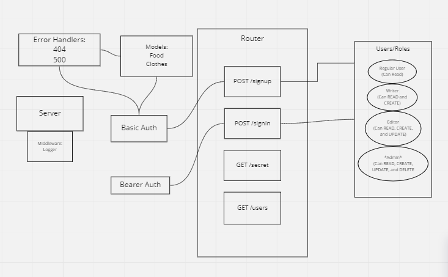

# auth-api

## Installation

to install run `git@github.com:ryanyinlee/auth-api.git`

`cd` auth-api

run `npm init -y`

`npm i dotenv express jest lint node pg router routes sequelize sequelize-cli sqlite3 supertest bcrypt base-64 cors morgan jsonwebtoken`

## Usage

`npm start` to run server

`npm test` to test server in terminal

`nodemon` is  better for testing

## Routes

CRUD

**User**

/signup

Use the JSON body in ThunderClient and POST.

```
{
  "username": "john2",
  "password": "foo"
}
```

/signin

Use the handy Basic Auth in ThunderClient and POST

username: john
password: woo

**User Roles**

```js
          user: ['read'],
          writer: ['read', 'create'],
          editor: ['read', 'create', 'update'],
          admin: ['read', 'create', 'update', 'delete']
```

## Current Deploys/GitHub Repository

GitHubRepository

https://github.com/ryanyinlee/auth-api

Dev Branch:

https://ryanyinlee-auth-api.herokuapp.com/

Main/Production - Due to Heroku limitations this hasn't been used. Just running dev.

## UML



## Credit/Reference